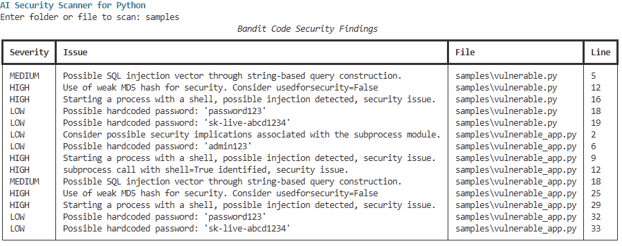
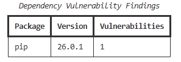
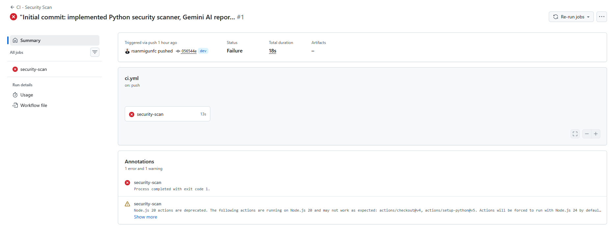

# AI Security Scanner for Python (Gemini-Powered)


---

## Overview

This project implements an AI-assisted security analysis pipeline that scans Python code for vulnerabilities and generates structured cybersecurity reports using the Gemini API.

The workflow integrates:

* Static code analysis
* Dependency vulnerability scanning
* AI-based risk interpretation
* Direct AI code analysis (pure AI scanner)

---

## Architecture

```text
Developer Input (Python Code)
            │
            ▼
   Static Analysis (Bandit)
            │
            ▼
 Dependency Scan (pip-audit)
            │
            ▼
   Aggregated Scan Results (JSON)
            │
            ▼
   Gemini API (AI Processing)
            │
            ▼
 AI Security Report Generation
            │
            ▼
 Reports Output (/reports folder)
            │
            ▼
 GitHub Actions CI Pipeline
```

---

## Key Features

* Static Code Analysis using Bandit
* Dependency Vulnerability Scanning using pip-audit
* AI Security Report Generation using Gemini API
* Pure AI Code Scanner (Gemini-only analysis)
* Automated CI security scanning via GitHub Actions
* Structured reporting saved in `/reports`
* Secure API key management using `.env`

---

## Continuous Integration (CI)

A GitHub Actions pipeline runs on every push and pull request.

The pipeline:

* Executes Bandit for static analysis
* Executes pip-audit for dependency vulnerabilities
* Fails the build when vulnerabilities are detected

Note:
The sample code intentionally contains insecure patterns to demonstrate detection. CI failures indicate the scanner is working correctly.

---

## Project Structure

```text
ai-security-scanner-python/
│
├── scanner.py
├── ai_report.py
├── ai_only_scanner.py
├── requirements.txt
├── README.md
├── .gitignore
├── .env
│
├── samples/
│   └── vulnerable_app.py
│
├── docs/
│   └── screenshots/
│
└── reports/
    ├── scan_summary.json
    └── gemini_security_report.txt
```

---

## Setup Instructions

### 1. Clone the repository

```bash
git clone https://github.com/YOUR-USERNAME/ai-security-scanner-python.git
cd ai-security-scanner-python
```

---

### 2. Create virtual environment

```bash
python -m venv venv
venv\Scripts\activate
```

---

### 3. Install dependencies

```bash
pip install -r requirements.txt
```

---

### 4. Configure Gemini API Key

Create a `.env` file:

```env
GEMINI_API_KEY=your_api_key_here
```

---

## How to Run

### Option 1 — Full Security Pipeline

Runs Bandit + pip-audit + AI reporting:

```bash
python scanner.py
```

Then:

```bash
python ai_report.py
```

---

### Option 2 — Pure AI Scanner

Directly analyzes code using Gemini (no Bandit/pip-audit):

```bash
python ai_only_scanner.py samples/vulnerable_app.py
```

---

## Pure AI Scanner

The pure AI scanner sends raw Python code directly to Gemini for analysis.

It provides:

* Vulnerability identification
* Explanation of risks
* Business impact
* Secure code fixes

This approach is useful for:

* Understanding vulnerabilities in plain language
* Identifying logic-level issues
* Generating remediation guidance

---

## Screenshots

### Static Code Analysis Output



### Dependency Scan Output



### AI Security Report


### CI Pipeline Execution



---

## Sample Vulnerabilities Detected

* SQL injection
* Weak password hashing (MD5)
* Command injection
* Hardcoded credentials
* Exposed API secrets

---

## AI Report Output

The generated report includes:

* Executive Summary
* Key Security Findings
* Risk Level
* Business Impact
* Recommended Fixes
* Priority Action Plan

---

## Security Notes

* `.env` is excluded from version control
* API keys are not committed
* CI enforces security checks automatically

---

## Technologies Used

* Python
* Bandit
* pip-audit
* Rich
* Google Gemini API (`google-genai`)
* GitHub Actions

---

## Use Cases

* Cybersecurity portfolio project
* DevSecOps workflow demonstration
* AI-assisted vulnerability analysis
* Secure coding education

---

## Future Enhancements

* Streamlit dashboard
* CI artifact reports
* Coverage integration
* Severity-based CI controls

---

## Author

Roberto Alberto San Miguel
Master of Data Analytics
Toronto, Canada

---

## GitHub Description

AI-powered Python security scanner with CI pipeline, static analysis, dependency auditing, and Gemini-based reporting.
